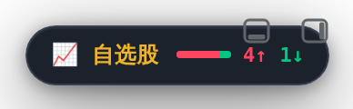
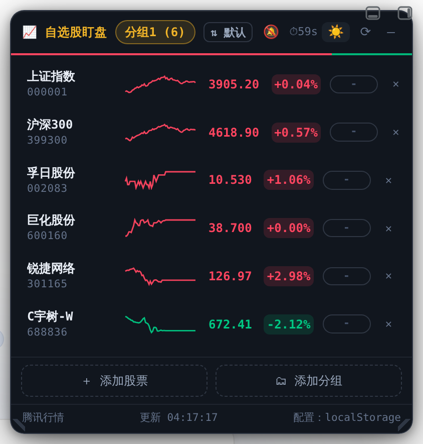
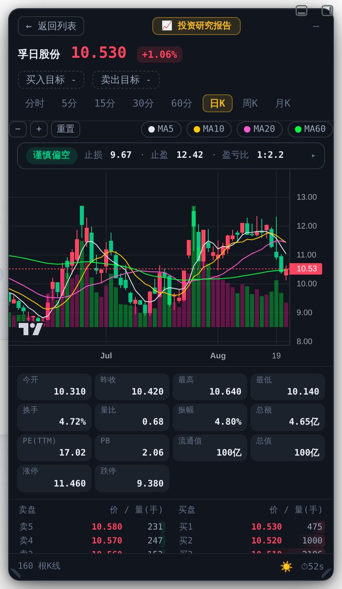
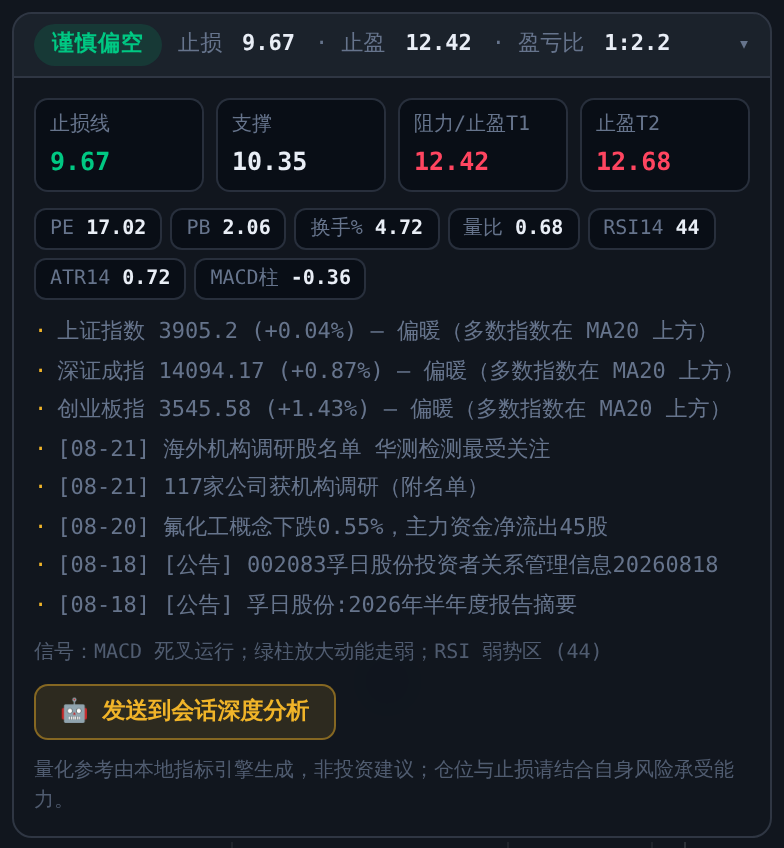
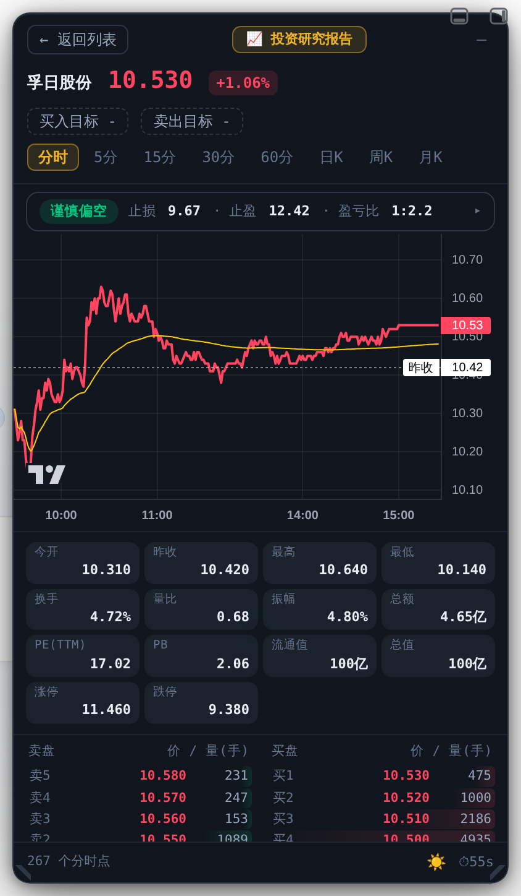
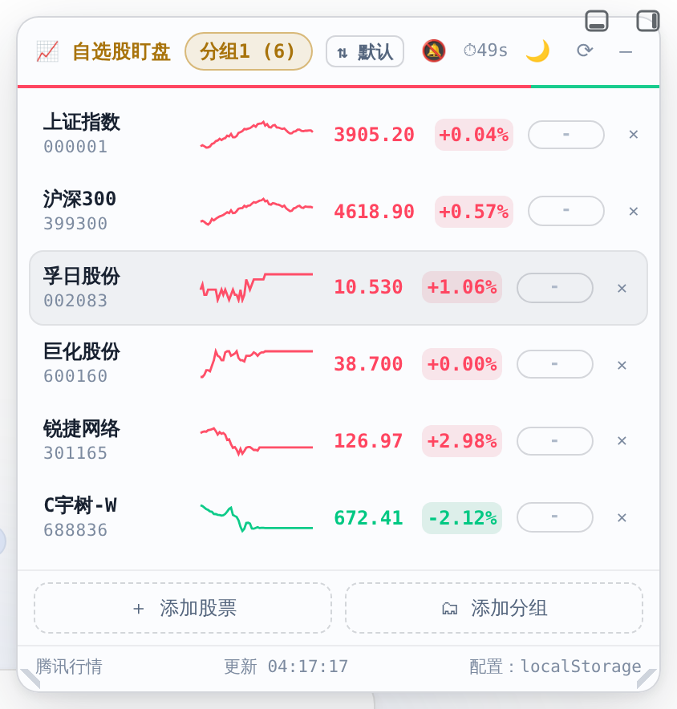

<h1 align="center">dsh-stock-watch</h1>
<p align="center">
  <a href="https://github.com/Awu12277/dsh-stock-watch"></a>
  
  
</p>

> **增强版 Fork**：基于 [Awu12277/dsh-stock-watch](https://github.com/Awu12277/dsh-stock-watch) v1.0.8（MIT）深度改造——
> 全新「墨金行情终端」界面、AI 持仓建议引擎（技术指标评分 + 止损止盈线推导）、性能与稳定性大幅强化。
> 改动明细见 [OPTIMIZATIONS.md](OPTIMIZATIONS.md)。

A 股自选股实时行情**盯盘插件**：在 [DeepSeek Harness](https://github.com/deepseek-ai/deepseek-harness)（DSH）Web 界面的**右上角**显示一个可折叠弹窗，实时监控自选股行情、查看分时/K 线/五档盘口，并由本地量化引擎与 DSH 会话 AI 给出**每只股票的持有建议与止损止盈线**。

数据源与原终端 CLI 项目 [stocking](https://github.com/Awu12277/stocking) 同源（腾讯财经），配色沿用 A 股红涨绿跌惯例。

## 安装

```bash
dsh plugin --profile web add github:ggttol/dsh-stock-watch
```

- 本地开发安装：`dsh plugin --profile web add file:/path/to/dsh-stock-watch`
- 安装后**重启 `dsh web` 生效**；卸载：`dsh plugin --profile web remove dsh-stock-watch`

安装完成后刷新页面，右上角出现「📈 自选股」药丸。

## 截图

| 折叠药丸（右上角实时涨跌统计） | 暗色列表（分组 + 分时迷你折线 + 目标价触发） |
|---|---|
|  |  |

| 详情·日 K（置顶 AI 建议条 + Lightweight Charts 蜡烛图） | AI 持仓建议卡片展开（关键位/指标芯片/市场环境/资讯） |
|---|---|
|  |  |

| 暗色·分时（价格线 / 均价线 / 昨收基准） | 浅色主题 |
|---|---|
|  |  |

## ✨ AI 持仓建议引擎（v1.2.0 新增）

**双层智能架构**：数值部分本地确定性计算（可解释、零延迟），叙事判断交给 DSH 会话模型。

### 第一层：量化内核（`/dsh-stock-watch/advice`）

打开任意股票详情，顶部即见建议条：

```
[谨慎偏空]  止损 9.67 · 止盈 12.42 · 盈亏比 1:2.1    ▸
```

- **指标引擎**：MA5/10/20/60 排列 · MACD(12,26,9) · RSI14(Wilder) · KDJ(9,3,3) · BOLL(20,2) · ATR14 · 量比(5日/20日)
- **加权评分** −100~+100 → 五档评级（偏多 / 谨慎偏多 / 中性观望 / 谨慎偏空 / 偏空），每条信号理由可解释
- **止损止盈线**：趋势强时结构位优先（波段低点 − 0.25ATR 与 close−2.2ATR 取高）；弱势收紧至 close−1.2ATR；止盈 T1=阻力位、T2=波段高点或 3ATR，附盈亏比
- **市场环境**：上证 / 深成 / 创业板三指数 MA20 风偏判定（偏暖 / 震荡分化 / 偏冷）
- **资讯聚合**：东财个股新闻 + 公司公告自动进卡片（各缓存 10 分钟）
- 展开可见四格关键位（止损/支撑/阻力T1/T2）、指标芯片（PE/PB/换手/量比…）、信号理由与非投资建议声明

### 第二层：会话深度研判

「🤖 发送到会话深度分析」把完整量化上下文组装成【AI持仓研判】富消息送入新 DSH 会话，
模型输出结构化研判：①核心结论与信心度 ②修正后止损止盈及依据 ③未来两周观察点 ④风险因素——可联动 `investment-research` 技能补充基本面。

## 功能特性

- **右上角可折叠弹窗**：折叠时显示自选股实时涨跌统计；展开为完整列表，点击任意行进入详情
- **八方向窗口缩放**（v1.2.2）：四边 + 四角热区任意拉伸，对侧边缘固定，视口边界钳制；AI 建议条置顶，小面板免滚动可见
- **胶囊可拖动 + 边缘吸附**：按住药丸拖到屏幕任意位置，拖到四边自动吸附为半球（显示涨/跌家数 `3↑0↓`）
- **多分组自选股**：分组 tab 切换，配置以服务器文件为唯一数据源（多端同源）
- **实时行情列表**：现价 / 涨跌幅 / 分时迷你折线 / 目标价触发标记，10s 自动刷新；⇅ 一键循环排序
- **分时视图**：分钟价格线 + 均价线(VWAP) + 昨收基准，A 股交易时段时间轴
- **K 线视图**：日K / 周K / 月K 前复权蜡烛 + 成交量 + MA5/10/20/60 均线显隐，`+/−/重置` 缩放；支持沪深主板 / 创业板 / 科创板 / **北交所 / 港股 / 美股**代码；基于 [TradingView Lightweight Charts](https://tradingview.github.io/lightweight-charts/docs)，CDN 失败自动降级自绘 SVG
- **到价提醒**：设置买入/卖出目标价后，价格触发跃迁弹系统通知
- **一键投资研究报告**：「📈 投资研究报告」新建对话发送 `分析{公司名}`，agent 自动完成 investment-research 研究 + frontend-design 网站
- **悬浮扇形菜单**：GSAP 扇形动画展开 📊 行情分析 / 📅 每日复盘 / 🚀 涨停分析（每日复盘仅收盘后可用），新开对话执行
- **暗色 / 浅色主题**：☀️/🌙 一键切换，图表配色联动
- **安装时自动注入技能**：`investment-research`、`frontend-design` 复制到 `~/.agents/skills/`（不覆盖已有）

## 架构

```
┌─────────────── Web 浏览器 ───────────────┐
│  client.js（客户端插件模块）              │
│  · shell.overlay 槽位 → 右上角弹窗        │
│  · React + Lightweight Charts + SVG 降级  │
│          │ fetch（同源 /dsh-stock-watch/*）│
└──────────┼────────────────────────────────┘
           ▼
┌─────────────── DSH Host（index.js）───────┐
│  cordis 插件：webServer 注册 7 个路由      │
│  · /config   分组与目标价持久化            │
│  · /stocks   全 A 股搜索                  │
│  · /quotes   实时行情批量快照              │
│  · /kline    日/周/月/分钟级 K 线          │
│  · /minute   分时详情                     │
│  · /advice   AI 持仓建议（量化引擎）★new   │
│  · 系统提示注入：分析/研判/复盘指令          │
└───────────────────────────────────────────┘
```

### 数据源

- 行情快照 + 分时：`web.ifzq.gtimg.cn/appstock/app/minute/query`
- 日/周/月 K 线：`web.ifzq.gtimg.cn/appstock/app/fqkline/get`（前复权，港美股自动回退不复权键）
- 分钟级 K 线：`ifzq.gtimg.cn/appstock/app/kline/mkline`（沪深；港美股不支持分钟级）
- 个股新闻：东财搜索 API（按公司名）；公告：东财公告 API（按代码）

解析逻辑与 [stocking 的 market.ts](https://github.com/Awu12277/stocking/blob/main/src/market.ts) 同源。Host 端使用 Node 原生 `fetch` 直连。

## License

MIT © Awu12277（上游）· 增强版改动同样以 MIT 发布
